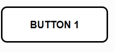

# Pattern library

## Background

Pattern libraries are libraries that have a myriad of UI elements which can be applied into a user's website. They normally consist of specified visual elements such as navbars, header elements, button types, jumbotron and footers. Pattern libraries are merely, frameworks and are comparable to well known frameworks such as bootstrap, which specialize in visual elements. Pattern libraries can save users a various amount of time, as it allows for users to already have elements pre-made for them. Users can apply these visual elements to their websites allowing them to be more efficient when producing their websites.

## Project aim

The main purpose is to produce a pattern library from foundation and establish an understanding of how frameworks function. A correlating documentation website is also to be made along with UI elements shown implemented into the website. Code will also be shown on the website, allowing potential users to effectively use the code snippets and apply it to their own websites.

# Research

## What is a pattern library?

A pattern library is a solution to help overcome the issue of building a website from scratch each time, as this can get frustrating for some and can be tremendously time consuming as various elements need to be re-created. In this 
[article](https://medium.com/@whatjackhasmade/pattern-libraries-abcc45c6144c) it says a pattern library often contains snippets of html and that pattern libraries mainly focus in interface design.

## Example of a pattern library

[Mailchimp](https://ux.mailchimp.com/patterns/color) is just one example of a pattern library which contains many web functional elements such as typography to grid systems. Mailchimp is popular with the web design community, stats from [semrush](www.semrush.com) indicate that the average visits a year since April 2019 have been around 16.5 million for mail chimp, indicating that the actual pattern library on UX mail chimp has a potential 16.5 million consumers.

## Inspiration

Having used frameworks and pattern libraries in the past, one library stood out the most, as it had been used before and was extremely simple as well as being the most popular library in the world according to the official website. Bootstrap, a framework often used for basic programming languages such as html, CSS and JavaScript specifically stood out due to its simplicity and ease of use as it had been implemented in many personal projects. The inspiration had motivated to create a simple library that could be used in the industry.

## Implementing the library

The library will be implemented from scratch as this is the best way to approach it as it will allow for no interference from third party frameworks which may cause confusion with the concept. The pattern library will be coded on cloud9, an online coding service and changes will be version controlled via GitHub for efficiency.

# Design Process method

The design process method will help determine how to approach, creating the library along with creating the elements. [Software development life cycle](https://blog.testlodge.com/software-development-life-cycle/) is a process that will allow for the whole project to be completed in a short amount of time while simultaneously being efficient. First the process will need to be analysed then effectively a method will need to be applied in conjunction.

The process steps are:

1. Identify the [https://stackify.com/sdlc-phases-identify-problems/](current problems )- Pattern library
2. Plan- Plan out each phase using the water fall method
3. Design- Look at other current design trends and design visual elements
4. Build- build the library
5.  Test- check if the library works
6.  Deploy- host the website
7.  Maintain- maintain constantly and keep in check with modern design trends

The SDLC method that will be used is the water fall method, as this is the most simplistic as well as the most popular method and will allow for the steps to be structured with individual stages. Each stage will have a small plan and will allow for it to waterfall into the next stage. The criteria will be met at each stage, however there is a risk that small details may end up being left incomplete, meaning that it could hold up the whole process.

# Test Plan/process – for both technical and user testing

It will be essential to ensure that everything is working and is at a high standard so therefore technical testing and user testing will need to be done.

## Technical testing

For technical testing the html as well as any styling will need to be of high standard, so to check for any errors the [ validater from w3]( https://validator.w3.org/) website will be used to ensure there are no errors within the html. This will allow for any mistakes such as misspelled letters and various other issues to be eradicated, making the code itself sustainable.

Another way that the technical testing will take place is testing the code on different browsers such as google chrome, Edge and safari. The reason for this is due to different internet browsers interpreting the code in entirely different ways, for example nav bars and other elements might potentially not function on certain browsers. After each phase of the code is complete; for example, a html page, then tests will be conducted on each browser allowing for efficient workflow. After the pattern library is completed the final product will also be tested on all internet browsers.

## User testing

User testing is an essential as effectively it can help to understand the needs of a potential consumer. For example, a pattern library has many elements that will contribute to a user's needs, however some elements might be missing so therefore feedback gained from user testing will allow for more elements to either added or redesigned.

So how will a user test the pattern library? User testing will take place and specified areas such as UI elements as well as the website will be the focus of user testing. Each element such as the navbar will be tested and users will have a chance to rate the UI and give feedback on how to improve on each element.

To do the user testing, there will be documentation pages stating what each element is, how they can implement these features and feedback will be provided by users specifying weather elements are clear enough to be distinct from other elements. They will also be asked if code snippets are simple enough to be understood.

# Specification

The specification for the pattern library was simple and didn't consist of many elements. Elements needed

1. Navigation Bar
2. Header Element static
3. A range of six button types
4. Jumbotron (call to action)
5. Footer with social media icon
6. Component of your choice

## Documentation

- Side navigation showing all the components
- Separate page explaining how to download and set up the pattern library
- Examples of each element
- Code snippets for user to copy and paste

## Design and planning

To start off the implementation process, a design phase was a requirement, as this would help visualise what the pattern library could possible look like. Simple wire frames would allow for this to be possible as wireframing techniques would give a clearer concept of how to build the library. Wire frames would determine and help plan where specific elements such as the navbar or instructions would go.

Many nav bars were looked and designs were analysed from[mdbootstrap](https://mdbootstrap.com/docs/jquery/navigation/sidenav/) and it mentions _"By virtue of its clarity and simplicity it remarkably increases User Experience. It allows you to navigate through small applications as well as vast portals swiftly"_. It was decided that the navigation bar would be used and placed towards the left-hand side like a drop-down menu as this would allow for a friendly user experience. It would also allow for more elements to be added in the future, whereas a nav bar in the header would only allow limited elements. As shown in code pen the navbar is limited however because of responsiveness more elements can still be added but would interfere with the page when resized.

**NAVBAR CODE PEN**

[ Navbar experimentation ]( https://codepen.io/hamzah90/pen/XwRvVY)

 As shown below the wireframe. Depending on the elements, the elements will be placed inside boxes and displayed underneath each other with details about the element underneath the boxes. This is similar to bootstrap cards; however, pure CSS will be used.

## Responsive grid

Placing elements side by side normally can be a challenge as these elements normally rely on the float property to be set to the left or right. But due to how the property is set, elements can tend to overlap with each other which can be a big issue in design terms. So therefore, a CSS grid was to be made as this would ensure everything is responsive. It was a 12column grid as this is simply how many columns a grid typically needs.

Building a 12column grid was simple and was experimented with so that it was suitable to be implemented into the library. The elements would be placed side by side as shown in the picture below.  When the grid was resized, all the divs stuck together and repositioned themselves.

Below is the code pen experimentation that took place:

[ 12 column grid experimentation]( https://codepen.io/hamzah90/pen/joyXqY)

# Buttons

The buttons would need to be simplistic and unique, so adobe XD was used to design a simplistic button that would cater to the needs of modern users. The buttons designs would be expanded on as well as simultaneously having the effect of a modern design. Below is the simplistic button that will be used when implementing the library. The button will have rounded edges, and this will be achieved using the border radius option on a normal button. The design will also have the potential to be expanded due to its default look. Colours and animations can be added to make multiple unique buttons. Opacity and hover effects will give off more modern feel to the buttons.

# Implementation

# Sticky footer experiment

This consisted on creating a footer element with social media icons, however the footer would need to be stuck at the bottom of the page. This was an issue but later it was discovered that to do this the position element in CSS would need to be fixed as when the footer div was tested with other positions such as relative, the footer wouldn't stick to the bottom of the page. The footer element would also be added to the library.

[sticky footer experiment ](https://codepen.io/hamzah90/pen/GambWX)

# Structure

A basic structure would be required for each page, so a template was created in html which consisted with a simple header tag, nav tag, component tag and footer tag. These divs were styled in CSS, which allowed for the nav bar to be displayed to the left-hand side of the page and for the main section a component tag was created. The component tags were like panels and this is where information would be stored. Like a place holder for Information such as text and elements such as buttons. The component tag was made sure to be positioned in the middle of the page as well as being responsive. As shown below the panel has the whole header placed on it and doesn't fill up the whole page, allowing for the element to be viewed inside the div. Below is also code pen experimentation where the div was created and has a hover effect applied for a modern feel.

[structure panel](https://codepen.io/hamzah90/pen/gJWNyJ)

The header tag would be where the navigation bar would be stored, in each page and the footer tag was where details would be listed but wasn't a requirement.

# Conclusion

Overall during the whole process of creating the pattern library, many issues were encountered but soon resolved. Some components stopped working as the whole process was being built on cloud9, an online service for coding. Cloud9 at times became buggy and stopped working, however despite this the overall pattern library was simple to build. Once this was completed, the was hosted on github pages. "hamzahj.github.io"

Three people were asked simple questions about the completed pattern library and these answers were taken into consideration for future references and how it can be improved.

**Is the library documentation simple to understand?**

Participant 1: yes

Participant 1: yes

Participant 1: yes

Participant 1: yes

**Was it easy to download the files for your html pages?**

Participant 1: yes

Participant 1: yes

Participant 1: yes

Participant 1: yes

**Did you find that adding the elements to your website were easy?**

Participant 1: yes

Participant 1: yes but the grid was slightly hard to implement

Participant 1: yes

Participant 1: yes

**Was there anything you didn't like in the library?**

Participant 1: No

Participant 1: colour scheme

Participant 1: No but would have liked if a sass file was there

Participant 1: no

Github website link: hamzahj.github.io
Github repository link : https://github.com/Hamzahj/patternlibrary

